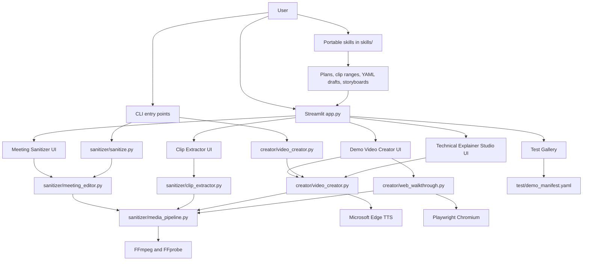

# CAT Video Tools

**CAT Video Tools** is a review-first video production suite for turning recordings, demos, screenshots, source material, and technical explanations into cleaner, shareable video assets.

It combines a Streamlit app, reusable Python media engines, and portable Clawpilot / Agency Copilot skills. The app does deterministic rendering and validation; the skills help users prepare better plans, scripts, clip ranges, and teaching briefs before they render.

## What you can do

| Workflow | Use it when you have | Output |
|---|---|---|
| **Meeting Sanitizer** | A meeting recording, transcript, and target speakers | A cleaned recording with non-target segments removed or masked |
| **Clip Extractor** | A long recording and a list of ranges | Publishable MP4 clips with normalized audio/video |
| **Demo Video Creator** | A demo brief, YAML script, screenshots, clips, page URL, or guided-tour steps | A narrated product demo or guided web tour |
| **Technical Explainer Studio** | A hard topic, source links/files, and a teaching goal | A source-grounded storyboard and rendered technical explainer |
| **Test Gallery** | Curated demo configs and generated examples | A browsable gallery of representative outputs |

## Quick start

```bash
git clone https://github.com/KarimaKT/cat-video-tools
cd cat-video-tools

python -m venv .venv
.venv\Scripts\activate

pip install -r requirements.txt
python -m playwright install chromium

streamlit run app.py
```

Open the local app at the URL Streamlit prints, usually `http://localhost:8501`.

### Prerequisites

- **Python 3.10+**
- **FFmpeg and FFprobe** on PATH
  - Windows: `winget install Gyan.FFmpeg`
  - macOS: `brew install ffmpeg`
- **Playwright Chromium** for guided web-tour capture
  - `python -m playwright install chromium`
- Optional: **Node.js** if you want to use `npm test` as the smoke-test wrapper

If FFmpeg was installed while your shell was open on Windows, refresh PATH:

```powershell
$env:Path = [System.Environment]::GetEnvironmentVariable("Path","Machine") + ";" + [System.Environment]::GetEnvironmentVariable("Path","User")
```

## Use the app

Launch:

```bash
streamlit run app.py
```

The app is designed around review-before-render workflows.

### Meeting Sanitizer

Use this when you need to clean up a meeting recording while preserving only selected speakers and masking non-target participants.

1. Open **Meeting Sanitizer**.
2. Upload a video recording and transcript (`.vtt`).
3. Enter the speaker names to keep.
4. Review detected speakers, disturbance zones, and proposed clean segments.
5. Optionally verify a masked frame at a source timestamp.
6. Add optional title and ending cards.
7. Render and download the final MP4.

The workflow favors safety: audit first, verify the mask, then render.

### Clip Extractor

Use this when you already know the moments you want from a longer recording.

1. Open **Clip Extractor**.
2. Upload the source recording.
3. Paste clip ranges in this format:

```text
6:09 - 7:17 | Agents Are Not Apps | AI agents
22:51 - 26:20 | Natural Language to Query | Structured data
```

4. Review titles, categories, and durations.
5. Render validated clips.

Clips are re-encoded instead of stream-copied. That avoids common publishing issues such as missing audio, corrupt clips, bad keyframe cuts, and inconsistent media settings.

### Demo Video Creator

Use this to produce a short app, product, portal, or workflow demo.

1. Open **Demo Video Creator**.
2. Provide a brief or upload/edit a YAML script.
3. Optionally add screenshots, image folders, video clips, or a guided web-tour URL and steps.
4. Choose narration voice, duration, and media options.
5. Review the generated script/YAML before rendering.
6. Render a narrated MP4.

Demo videos can combine:

- generated intro/context slides
- uploaded screenshots or images
- embedded video clips
- guided web-tour footage
- Microsoft Edge TTS narration
- optional background music

### Technical Explainer Studio

Use this when the goal is teaching, not just showing a UI.

1. Open **Technical Explainer Studio**.
2. Provide the topic, audience, misunderstanding to correct, feature focus, and optional source links/files.
3. Review the generated teaching plan, mental model, source summary, and storyboard.
4. Split broad material into a series if needed.
5. Render only after the storyboard and critique pass.

### Test Gallery

The **Test Gallery** reads `test/demo_manifest.yaml` and displays curated examples. Keep it lean: representative configs, review JSON, thumbnails, and sanitized demo references are appropriate; private transcripts and large source recordings should stay out of source control.

## Use the CLI

The app is the recommended entry point, but the core engines are also scriptable.

### Meeting Sanitizer CLI

Create a starter project:

```bash
python sanitizer/sanitize.py --init ai_webinar
```

Edit the generated YAML:

```yaml
template: ai_webinar
video: path/to/recording.mp4
vtt: path/to/transcript.vtt
output: output/clean_recording.mp4
keep_speakers:
  - Speaker 1
  - Speaker 2
```

Audit before rendering:

```bash
python sanitizer/sanitize.py ai_webinar_project.yaml --audit
```

Verify a masked frame at a source timestamp:

```bash
python sanitizer/sanitize.py ai_webinar_project.yaml --verify 300
```

Render:

```bash
python sanitizer/sanitize.py ai_webinar_project.yaml
```

Useful options:

```bash
python sanitizer/sanitize.py --templates
python sanitizer/sanitize.py ai_webinar_project.yaml --crf 20
python sanitizer/sanitize.py ai_webinar_project.yaml --no-audio-enhance
```

### Demo Video Creator CLI

Render a video from YAML:

```bash
python creator/video_creator.py examples/creator_demo.yaml output/demo.mp4
```

Minimal script:

```yaml
title: My Demo
resolution: 1280x720
fps: 30
voice: en-US-AriaNeural
voice_rate: "+8%"
music_volume: 0

scenes:
  - title: Introducing My App
    subtitle: What it does and why it matters
    visual: slide
    narration: Introducing My App. It helps teams turn raw work into a reviewable outcome.
    bullets:
      - Clear context
      - Guided workflow
      - Validated output
    accent_color: "#4fc3f7"

  - title: Product walkthrough
    visual: video
    video: examples/web_walkthroughs/my-tour.mp4
    narration: This guided tour shows the key flow and explains what the viewer should notice.
```

### Clip Extractor Python API

```python
from sanitizer.clip_extractor import ClipSpec, extract_clips

clips = [
    ClipSpec(
        id="agent-intro",
        title="Agents Are Not Apps",
        start=369,
        end=437,
        category="AI agents",
    )
]

extract_clips(
    video_path="recording.mp4",
    clips=clips,
    output_dir="output/clips",
)
```

### Media pipeline smoke test

Run this before shipping media changes:

```bash
python test/smoke_media_pipeline.py
```

Or through npm:

```bash
npm test
```

The smoke test synthesizes short video/audio assets with FFmpeg, renders segments, concatenates mixed media shapes, validates output with FFprobe, and exercises clip extraction.

## Architecture



### Key modules

| Module | Responsibility |
|---|---|
| `app.py` | Streamlit UI, upload/review/render flows, Test Gallery |
| `sanitizer/meeting_editor.py` | Transcript-driven meeting cleanup, speaker preservation, masking, audit, render |
| `sanitizer/clip_extractor.py` | Intentional clip extraction using validated render settings |
| `sanitizer/media_pipeline.py` | Shared FFmpeg/FFprobe commands, normalization, concatenation, validation |
| `sanitizer/sanitize.py` | Meeting Sanitizer CLI |
| `creator/video_creator.py` | YAML-to-video rendering, slides, image/video scenes, narration, music |
| `creator/web_walkthrough.py` | Guided browser tour capture and sidecar metadata |
| `scripts/` | Demo and learning-series generation scripts |
| `skills/` | Portable planning/drafting skills for better app inputs |
| `test/smoke_media_pipeline.py` | Synthetic media regression smoke test |

### Design principles

1. **Review before render**: users inspect plans, clips, masks, storyboards, and generated YAML before producing final media.
2. **One media pipeline**: sanitizer exports, clip extraction, guided tours, and demo videos share the same FFmpeg validation path.
3. **Validated outputs**: generated media is checked for playable audio/video streams and plausible duration.
4. **Skills prepare, app renders**: prompt skills help think and draft; Python modules do deterministic media work.
5. **Source-control hygiene**: generated source recordings, private transcripts, temporary files, and large media outputs are excluded by default.

## Portable skills

Skills live in [`skills/`](skills/) and can be copied or installed into Clawpilot / Agency Copilot.

| Skill | Use before | Produces |
|---|---|---|
| `/meeting-sanitizer-plan` | Meeting Sanitizer | Keep speakers, candidate cut ranges, masking checks, title/end-card text, review checklist |
| `/clip-extractor-plan` | Clip Extractor | Paste-ready ranges, viewer-facing titles, categories, review notes |
| `/demo-video-draft` | Demo Video Creator | Renderable Video Creator YAML with placeholder media paths |
| `/technical-learning-video` | Technical Explainer Studio | Topic brief, source notes, storyboard, learning arc guidance |
| `video_app_user.md` | Operating CAT Video Tools | Review-before-render usage guidance |
| `video_app_maker.md` | Building similar tools | Product and engineering guidance for human-reviewed video apps |

## Repository layout

```text
cat-video-tools/
├── app.py
├── requirements.txt
├── package.json
├── sanitizer/
│   ├── meeting_editor.py
│   ├── clip_extractor.py
│   ├── media_pipeline.py
│   ├── sanitize.py
│   ├── instructions.py
│   └── templates/
├── creator/
│   ├── video_creator.py
│   ├── web_walkthrough.py
│   ├── music.py
│   └── templates/
├── scripts/
├── skills/
├── test/
│   ├── demo_manifest.yaml
│   ├── README.md
│   └── smoke_media_pipeline.py
└── examples/
```

## Optional background music

The Video Creator can fetch royalty-free background music from Pixabay when configured.

```bash
set PIXABAY_API_KEY=your_key_here
```

Then in a script:

```yaml
background_music: auto
music_mood: tech
music_volume: 0.08
```

## What not to commit

The `.gitignore` is intentionally conservative for video work. Do not commit:

- raw meeting recordings
- private transcripts
- intermediate render folders
- generated large MP4/WAV/MP3 files
- personal project YAML files
- local-only absolute-path manifests

Commit small representative configs, review JSON, scripts, and docs instead.

## License

MIT
