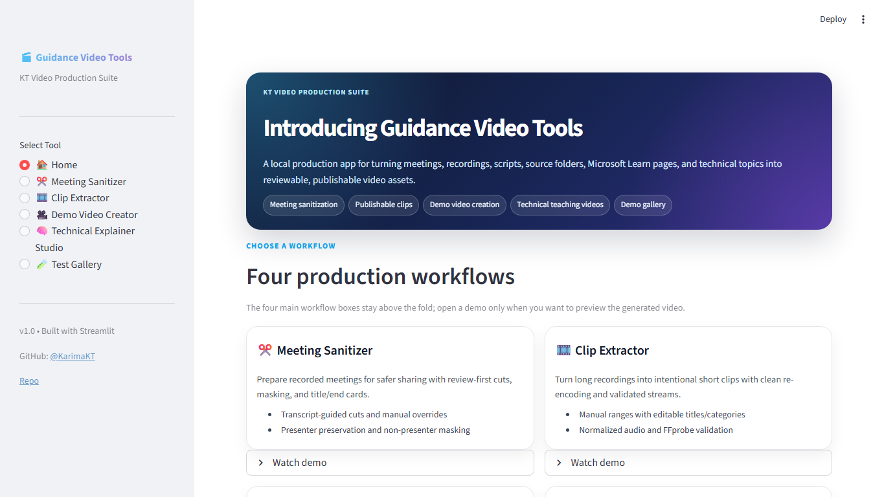
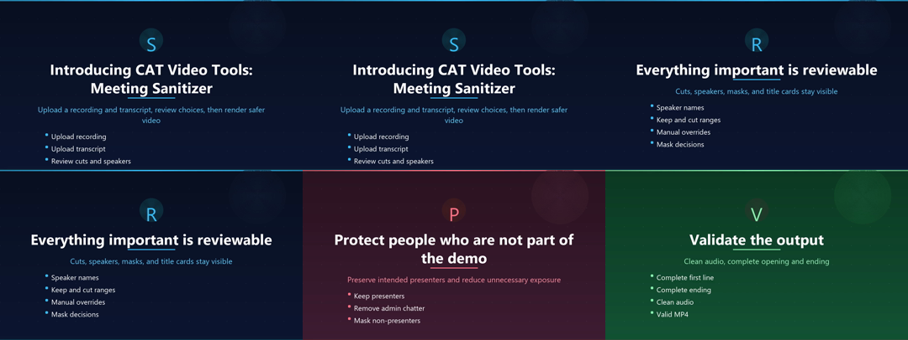
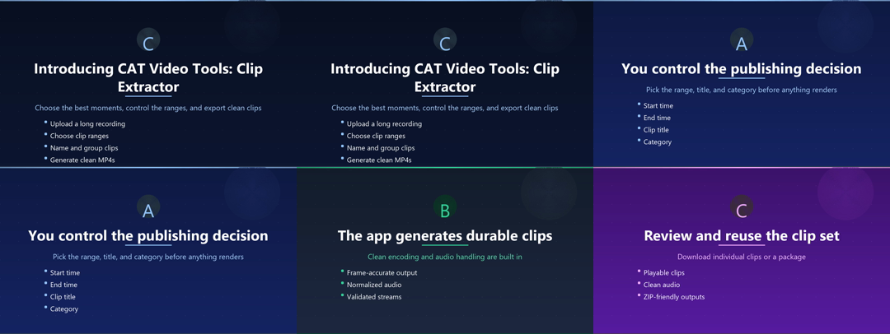
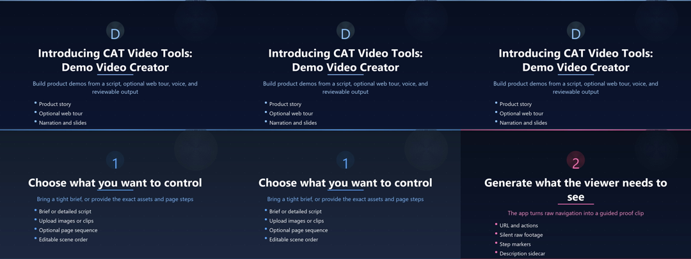
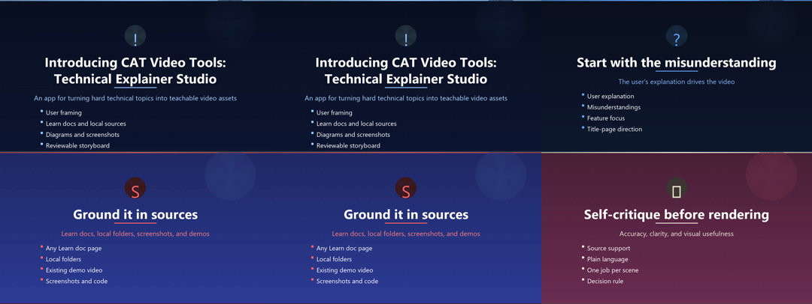
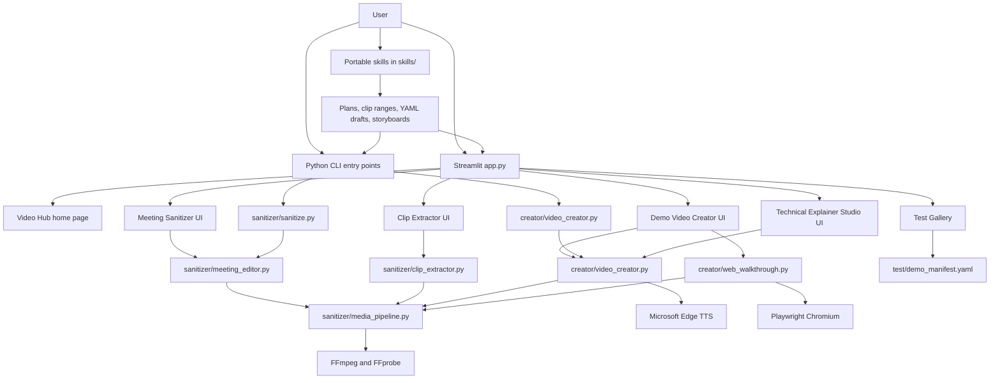

# Guidance Video Tools

**Guidance Video Tools** is a review-first video production hub for turning recordings, demos, screenshots, source material, and technical explanations into cleaner, shareable video assets.

The fastest way to use it is:

1. Clone the repo.
2. Ask Copilot CLI or Claw to use one of the included skills.
3. Review the generated plan, clip ranges, or YAML.
4. Either run the tool directly from the CLI with that YAML, or open the hub to paste/upload the YAML so you can view, tweak, and run it.

The app does deterministic media work. The skills help you get the YAML, timestamps, titles, storyboards, and QA plan right before you render.

## Fastest path: install, use a skill, run or review

```bash
git clone https://github.com/KarimaKT/guidance-video-tools
cd guidance-video-tools

python -m venv .venv
.venv\Scripts\activate

pip install -r requirements.txt
python -m playwright install chromium

streamlit run app.py
```

Open the local URL Streamlit prints, usually `http://localhost:8501`. This launches one hub, not separate apps. The sidebar gives users Home, Meeting Sanitizer, Clip Extractor, Demo Video Creator, Technical Explainer Studio, and Test Gallery in one place.

The fast path is not app-only. Use Copilot CLI or Claw to create the right YAML or clip plan, then choose one of two execution paths:

| Path | Use when | What you do |
|---|---|---|
| **Run from CLI** | You trust the YAML and want the fastest deterministic render | Save the YAML and run `python sanitizer/sanitize.py ...` or `python creator/video_creator.py ...` |
| **Review in the hub** | You want to inspect/tweak before rendering | Paste or upload the YAML/clip ranges in the matching tool, preview the plan, then render |

### Install or use the skills

The skills live in [`skills/`](skills/). You can use them in two ways:

1. **Fastest in Copilot CLI / Claw:** work from the repo root and ask the assistant to use the relevant file, for example `Use skills/demo-video-draft.md`.
2. **Reusable skill install:** copy the Markdown file into your Clawpilot / Agency Copilot custom skills location, or create a custom skill from the file contents.

| Skill file | Use it before | It produces |
|---|---|---|
| `skills/meeting-sanitizer-plan.md` | Meeting Sanitizer | Keep speakers, candidate cut ranges, masking checks, title/end-card text, review checklist |
| `skills/clip-extractor-plan.md` | Clip Extractor | Paste-ready ranges, viewer-facing titles, categories, review notes |
| `skills/demo-video-draft.md` | Demo Video Creator | Renderable Video Creator YAML with placeholder media paths |
| `skills/technical-learning-video.md` | Technical Explainer Studio | Topic brief, source notes, storyboard, learning arc guidance |

### Prompt: Meeting Sanitizer

```text
Use skills/meeting-sanitizer-plan.md.

I need to clean up a recorded webinar in Guidance Video Tools.
Recording path: [path to mp4]
Transcript path: [path to vtt]
Keep speakers exactly as: [speaker names as they appear in the transcript]
Remove or mask: [interruptions, non-presenters, admin chatter, private sections]
Known good range: [optional timestamps]
Known bad moments: [optional timestamps or transcript excerpts]
Title card: [desired title/subtitle]
Ending card: [desired close]

Create a review-first sanitizer plan. Do not invent timestamps. Mark anything uncertain as review_needed.
Then create a starter YAML I can audit with:
python sanitizer/sanitize.py [yaml file] --audit
```

After review:

```bash
python sanitizer/sanitize.py my_cleanup.yaml --audit
python sanitizer/sanitize.py my_cleanup.yaml --verify 300
python sanitizer/sanitize.py my_cleanup.yaml
```

### Prompt: Clip Extractor

```text
Use skills/clip-extractor-plan.md.

I need publishable clips from this recording:
Recording path: [path to mp4]
Transcript/notes: [paste transcript excerpts, rough topics, or timestamps]
Audience: [who will watch]
Goal: [what the clips should help viewers understand]
Preferred number of clips: [number]
Topics to emphasize: [topics]
Things to avoid: [privacy, weak moments, stale sections]

Return paste-ready clip ranges in:
MM:SS - MM:SS | Viewer-facing title | Category

Do not invent exact timestamps. If timestamps are missing, give a planning table and mark timestamp needed.
```

Paste the reviewed ranges into **Clip Extractor** in the app.

### Prompt: Demo Video Creator

```text
Use skills/demo-video-draft.md.

Create Guidance Video Tools Demo Video Creator YAML for:
Product/app/feature: [name]
Audience: [viewer]
Problem it solves: [pain]
Main features to show: [3-5 features]
Assets I have: [screenshots, clips, page URL, walkthrough notes]
Tone: [executive, maker, technical, customer-facing]
Target duration: [short duration]

The first scene must start with "Introducing [name]" and explain what was built, who it helps, and why it matters before mechanics.
Use placeholder image/video paths where I need to replace assets.
Return only valid YAML.
```

Save the reviewed YAML and render directly:

```bash
python creator/video_creator.py my_demo.yaml output/my_demo.mp4
```

Or paste/upload the YAML in **Demo Video Creator** to review and tweak scenes before rendering.

### Prompt: Technical Explainer Studio

```text
Use skills/technical-learning-video.md.

Create a technical learning video plan for:
Topic: [topic]
Audience: [viewer]
Misunderstanding to correct: [what people get wrong]
Feature focus: [what to highlight]
Sources: [Microsoft Learn URLs, local docs, screenshots, clips, code]
Desired format: [single explainer or learning series]
Viewer outcome: [what they should do differently]

Produce a source-grounded brief, storyboard, narration intent, visual strategy, two-pass viewer review checklist, and post-render QA checklist.
Do not produce a generic summary. Make it teach.
```

Bring the reviewed storyboard into **Technical Explainer Studio** in the app, or convert it into Video Creator YAML.

### Best prompting practices

- Start with the viewer and job-to-be-done.
- Provide source material, transcript excerpts, timestamps, screenshots, or URLs when available.
- Say what must be preserved, removed, masked, or emphasized.
- Require review gates: audit before render, verify frame, two-pass script review, or post-render QA.
- Do not ask the assistant to invent timestamps or product capabilities.
- Keep openings viewer-facing: product name, problem, audience, value, then mechanics.
- Ask for YAML only when you are ready to save or paste it.
- Treat generated YAML as a draft: review it in the app before rendering.

## The Video Hub

The default hub page is the front door. It shows the four current demo videos for the four production tools:



**Guided hub tour:** [Play narrated Video Hub tour](examples/web_walkthroughs/cat-video-tools-portal-walkthrough-narrated.mp4)

| Tool | What it is for | Demo on the front page |
|---|---|---|
| **Meeting Sanitizer** | Clean up meeting/webinar recordings for safer reuse | [Play video](examples/better_demos/sanitizer_review_first_demo.mp4) |
| **Clip Extractor** | Turn long recordings into short publishable clips | [Play video](examples/better_demos/clip_extractor_publishable_demo.mp4) |
| **Demo Video Creator** | Create narrated product demos and guided web tours | [Play video](examples/better_demos/creator_decision_review_demo.mp4) |
| **Technical Explainer Studio** | Teach hard concepts with source-grounded storyboards | [Play video](examples/better_demos/technical_explainer_studio_demo.mp4) |

### Demo video previews

| Meeting Sanitizer | Clip Extractor |
|---|---|
| [](examples/better_demos/sanitizer_review_first_demo.mp4) | [](examples/better_demos/clip_extractor_publishable_demo.mp4) |
| [Play Meeting Sanitizer demo](examples/better_demos/sanitizer_review_first_demo.mp4) | [Play Clip Extractor demo](examples/better_demos/clip_extractor_publishable_demo.mp4) |

| Demo Video Creator | Technical Explainer Studio |
|---|---|
| [](examples/better_demos/creator_decision_review_demo.mp4) | [](examples/better_demos/technical_explainer_studio_demo.mp4) |
| [Play Demo Video Creator demo](examples/better_demos/creator_decision_review_demo.mp4) | [Play Technical Explainer Studio demo](examples/better_demos/technical_explainer_studio_demo.mp4) |

The **Test Gallery** keeps the rest of the generated test assets so they are not lost:

- tool test clips
- guided Video Hub tour videos
- screenshots and contact sheets
- review JSON
- YAML configs
- Copilot Studio evaluation learning-series examples built from public guidance

## Use the app

Launch the hub:

```bash
streamlit run app.py
```

This opens the single Guidance Video Tools hub. Users do not need to run four separate apps; the sidebar contains the four production tools plus the Test Gallery. The app is designed around review-before-render workflows.

### Meeting Sanitizer

Use this when you need to clean up a meeting recording while preserving selected speakers and masking non-target participants.

1. Open **Meeting Sanitizer**.
2. Upload a video recording and transcript (`.vtt`).
3. Enter the speaker names to keep.
4. Review detected speakers, disturbance zones, and proposed clean segments.
5. Optionally verify a masked frame at a source timestamp.
6. Add optional title and ending cards.
7. Render and download the final MP4.

The workflow favors safety: audit first, verify the mask, then render.

### Clip Extractor

Use this when you already know the moments you want from a longer recording.

1. Open **Clip Extractor**.
2. Upload the source recording.
3. Paste reviewed clip ranges:

```text
6:09 - 7:17 | Agents Are Not Apps | AI agents
22:51 - 26:20 | Natural Language to Query | Structured data
```

4. Review titles, categories, and durations.
5. Render validated clips.

Clips are re-encoded instead of stream-copied. That avoids common publishing issues such as missing audio, corrupt clips, bad keyframe cuts, and inconsistent media settings.

### Demo Video Creator

Use this to produce a short app, product, portal, or workflow demo.

1. Open **Demo Video Creator**.
2. Provide a brief or upload/edit a YAML script.
3. Optionally add screenshots, image folders, video clips, or a guided web-tour URL and steps.
4. Choose narration voice, duration, and media options.
5. Review the generated script/YAML before rendering.
6. Render a narrated MP4.

Demo videos can combine generated slides, uploaded screenshots, embedded clips, guided web-tour footage, Microsoft Edge TTS narration, and optional background music.

### Technical Explainer Studio

Use this when the goal is teaching, not just showing a UI.

1. Open **Technical Explainer Studio**.
2. Provide the topic, audience, misunderstanding to correct, feature focus, and optional source links/files.
3. Review the generated teaching plan, mental model, source summary, and storyboard.
4. Split broad material into a series if needed.
5. Render only after the storyboard and critique pass.

### Test Gallery

The **Test Gallery** reads `test/demo_manifest.yaml` and displays curated examples. Keep it lean: representative configs, review JSON, thumbnails, and sanitized demo references are appropriate; private transcripts and large source recordings should stay out of source control.

## Use the Python CLI directly

The app is the recommended entry point, but the core engines are also scriptable after the natural-language planning step.

### Meeting Sanitizer CLI

Create a starter project:

```bash
python sanitizer/sanitize.py --init ai_webinar
```

Edit the generated YAML:

```yaml
template: ai_webinar
video: path/to/recording.mp4
vtt: path/to/transcript.vtt
output: output/clean_recording.mp4
keep_speakers:
  - Speaker 1
  - Speaker 2
```

Audit before rendering:

```bash
python sanitizer/sanitize.py ai_webinar_project.yaml --audit
```

Verify a masked frame:

```bash
python sanitizer/sanitize.py ai_webinar_project.yaml --verify 300
```

Render:

```bash
python sanitizer/sanitize.py ai_webinar_project.yaml
```

### Demo Video Creator CLI

Render a video from YAML:

```bash
python creator/video_creator.py examples/creator_demo.yaml output/demo.mp4
```

Minimal script:

```yaml
title: My Demo
resolution: 1280x720
fps: 30
voice: en-US-AriaNeural
voice_rate: "+8%"
music_volume: 0

scenes:
  - title: Introducing My App
    subtitle: What it does and why it matters
    visual: slide
    narration: Introducing My App. It helps teams turn raw work into a reviewable outcome.
    bullets:
      - Clear context
      - Guided workflow
      - Validated output
    accent_color: "#4fc3f7"

  - title: Product walkthrough
    visual: video
    video: examples/web_walkthroughs/my-tour.mp4
    narration: This guided tour shows the key flow and explains what the viewer should notice.
```

### Clip Extractor Python API

```python
from sanitizer.clip_extractor import ClipSpec, extract_clips

clips = [
    ClipSpec(
        id="agent-intro",
        title="Agents Are Not Apps",
        start=369,
        end=437,
        category="AI agents",
    )
]

extract_clips(
    video_path="recording.mp4",
    clips=clips,
    output_dir="output/clips",
)
```

## Architecture



### Key modules

| Module | Responsibility |
|---|---|
| `app.py` | Streamlit hub, upload/review/render flows, Test Gallery |
| `sanitizer/meeting_editor.py` | Transcript-driven meeting cleanup, speaker preservation, masking, audit, render |
| `sanitizer/clip_extractor.py` | Intentional clip extraction using validated render settings |
| `sanitizer/media_pipeline.py` | Shared FFmpeg/FFprobe commands, normalization, concatenation, validation |
| `sanitizer/sanitize.py` | Meeting Sanitizer CLI |
| `creator/video_creator.py` | YAML-to-video rendering, slides, image/video scenes, narration, music |
| `creator/web_walkthrough.py` | Guided browser tour capture and sidecar metadata |
| `skills/` | Portable planning/drafting skills for better app inputs |
| `test/demo_manifest.yaml` | Demo/test gallery manifest |
| `test/smoke_media_pipeline.py` | Synthetic media regression smoke test |

### Design principles

1. **Review before render**: users inspect plans, clips, masks, storyboards, and generated YAML before producing final media.
2. **One media pipeline**: sanitizer exports, clip extraction, guided tours, and demo videos share the same FFmpeg validation path.
3. **Validated outputs**: generated media is checked for playable audio/video streams and plausible duration.
4. **Skills prepare, app renders**: prompt skills help think and draft; Python modules do deterministic media work.
5. **Source-control hygiene**: generated source recordings, private transcripts, temporary files, and large media outputs are excluded by default.

## Prerequisites

- **Python 3.10+**
- **FFmpeg and FFprobe** on PATH
  - Windows: `winget install Gyan.FFmpeg`
  - macOS: `brew install ffmpeg`
- **Playwright Chromium** for guided web-tour capture
  - `python -m playwright install chromium`
- Optional: **Node.js** if you want to use `npm test` as the smoke-test wrapper

If FFmpeg was installed while your shell was open on Windows, refresh PATH:

```powershell
$env:Path = [System.Environment]::GetEnvironmentVariable("Path","Machine") + ";" + [System.Environment]::GetEnvironmentVariable("Path","User")
```

## Test

Run this before shipping media changes:

```bash
python test/smoke_media_pipeline.py
```

Or through npm:

```bash
npm test
```

The smoke test synthesizes short video/audio assets with FFmpeg, renders segments, concatenates mixed media shapes, validates output with FFprobe, and exercises clip extraction.

## Repository layout

```text
guidance-video-tools/
├── app.py
├── requirements.txt
├── package.json
├── sanitizer/
│   ├── meeting_editor.py
│   ├── clip_extractor.py
│   ├── media_pipeline.py
│   ├── sanitize.py
│   ├── instructions.py
│   └── templates/
├── creator/
│   ├── video_creator.py
│   ├── web_walkthrough.py
│   ├── music.py
│   └── templates/
├── skills/
├── test/
│   ├── demo_manifest.yaml
│   ├── README.md
│   └── smoke_media_pipeline.py
└── examples/
```

## Optional background music

The Video Creator can fetch royalty-free background music from Pixabay when configured.

```bash
set PIXABAY_API_KEY=your_key_here
```

Then in a script:

```yaml
background_music: auto
music_mood: tech
music_volume: 0.08
```

## What not to commit

The `.gitignore` is intentionally conservative for video work. Do not commit:

- raw meeting recordings
- private transcripts
- intermediate render folders
- personal project YAML files
- local-only absolute-path manifests

Commit public demo outputs, small representative configs, review JSON, scripts, and docs instead.

## License

MIT
